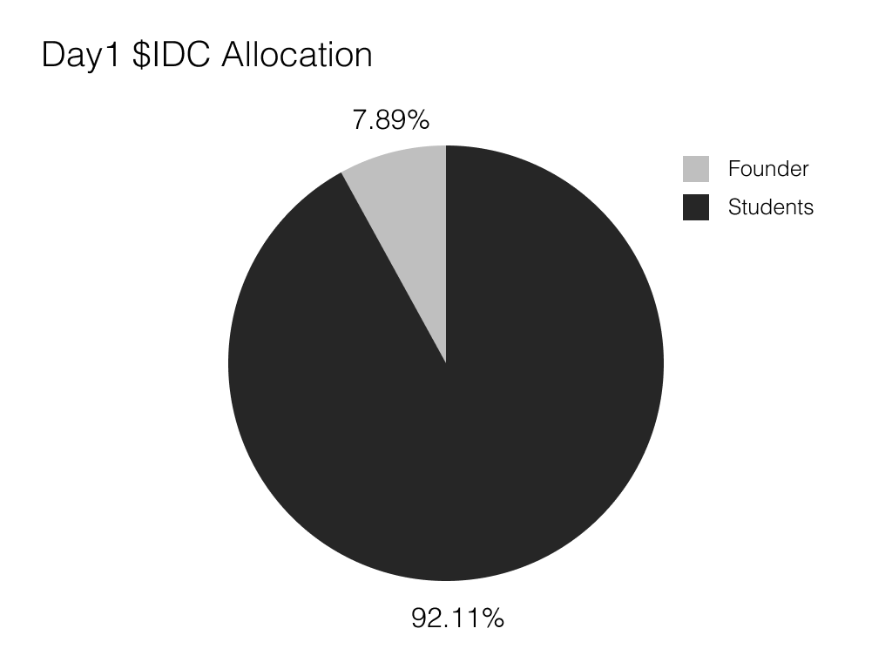
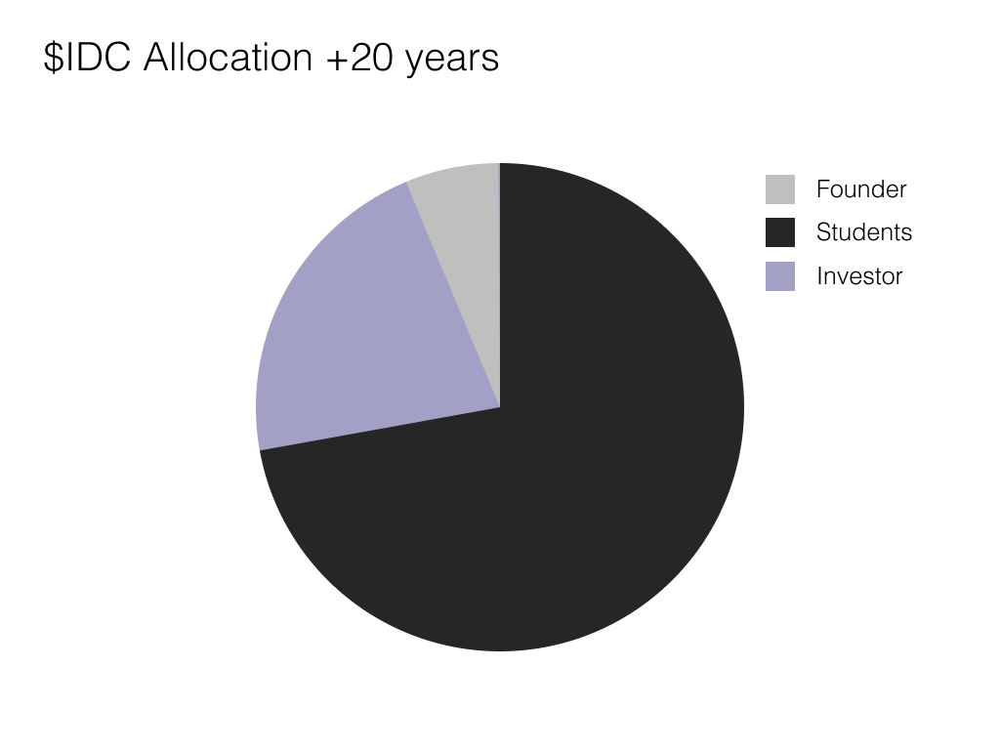

# 🪙 $IDC (iU DAO Coin)

$IDCは、Polygon POS上で展開されています。

### $IDCの概要

$IDCはiUDAOの**ガバナンストークン**です。\
iUDAOのオンチェーンガバナンスに参加することができます。

$IDCに保有によって、iUDAOの資金の利用に関する提案や、ガバナンスルールの改正などの提案に投票を行うことができます。

投票時、賛成、反対のいずれかに投じることができます。\
保有する$IDCの量と同量の有効投票数を保有することになります。保有$IDCが多ければ多いほど、影響力は大きくなります。

### 供給量とアロケーション

初回発行枚数は、582,000,000枚数です。\
20年間にわたって、以下のように配布されていきます。

* iUID発行時に、15,000IDCを配布。
* iUID保有者は、3ヶ月に1度、1,500IDCを受け取り可能。
* InvestorNFT保有者、3ヶ月に1度、30,000IDCを受け取り可能。
* FounderNFT保有者は、3ヶ月に1度、45,000IDCを受け取り可能。

$IDCの保有割合は以下の予想となっています。

<figure><figcaption>
初期段階のアロケーション
</figcaption></figure>

<figure><figcaption>
20年後のアロケーション
</figcaption></figure>
